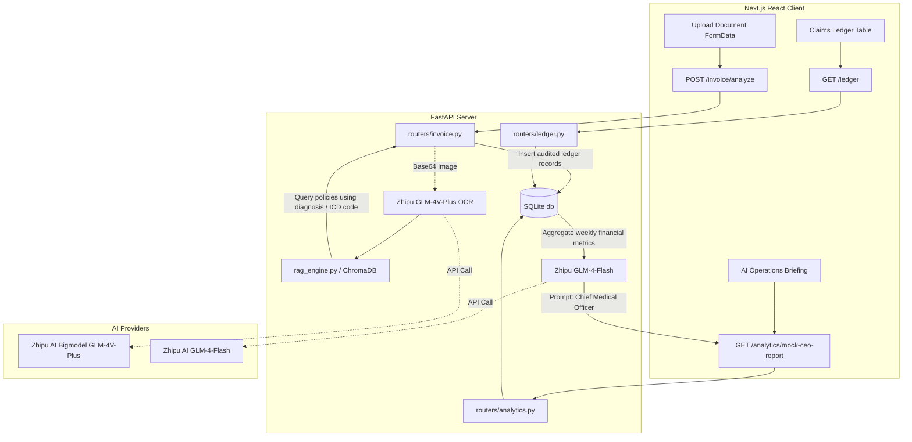

# VitaCross SaaS Platform MVP Architecture Plan

## 1. System Overview
The system is built on a decoupled, modern frontend-backend architecture designed for rapid demonstrations, pitch decks, and low-overhead cloud deployment. 

- **Frontend**: Next.js 14+ (React, Tailwind CSS, Zustand, Framer Motion). Handles interactive workflows, operational dashboards, and exports. Located in the `frontend/` directory.
- **Backend**: Python 3.11+ FastAPI. Implements RESTful endpoints, RAG compliance logic, and handles AI multi-agent orchestration. Located in the `backend/` directory.
- **Relational DB**: SQLite. A zero-dependency database storing patient claims ledger data (`LedgerItem`).
- **Vector DB**: ChromaDB. Powering context-aware insurer guidelines lookup by indexing policy directives (`docs/vitacross_policy.md`).
- **LLM Engines**:
  - **Zhipu AI**: Primary model (uses `glm-4v-plus` for multimodal OCR/ICD mapping and `glm-4-flash` for CEO reports).
  - **Google Gemini**: Fallback model (uses `gemini-2.5-flash-preview-05-20` for OCR and reports if Zhipu AI is unavailable).
  - **Demo Mode**: High-fidelity mock responses used if neither API key is active.

---

## 2. Directory Structure

```text
/vitacross-mvp
├── frontend/                     # Next.js Client Application
│   ├── src/
│   │   ├── app/                  # App Router screens (Dashboard, Analytics, settings, etc.)
│   │   ├── components/           # Reusable layout and ui widgets (Sidebar, Topbar, ExportToolbar)
│   │   └── lib/
│   │       └── api.ts            # Axios configuration pointing to local port 8000
│   ├── package.json
│   └── vercel.json
│
├── backend/                      # FastAPI Backend Application
│   ├── app/
│   │   ├── main.py               # Application entryway & CORS middleware configuration
│   │   ├── core/
│   │   │   ├── config.py         # Pydantic BaseSettings loading .env configurations
│   │   │   ├── database.py       # SQLite connection & zero-downtime schema migrations
│   │   │   └── seeder.py         # High-fidelity international patient claims seed data
│   │   ├── models/
│   │   │   ├── domain.py         # SQLAlchemy DB models (medical fields & claim statuses)
│   │   │   └── schemas.py        # Pydantic Request/Response verification models
│   │   ├── routers/
│   │   │   ├── invoice.py        # Route: /invoice/analyze (multimodal billing OCR)
│   │   │   ├── ledger.py         # Route: /ledger (claims ledger CRUD actions)
│   │   │   ├── analytics.py      # Route: /analytics/mock-ceo-report (AI brief generation)
│   │   │   └── workflow.py       # Route: /workflow/config (settlement routing rules)
│   │   └── services/
│   │       ├── gemini_agent.py   # Zhipu AI Ark & Google Gemini multi-model agent
│   │       └── rag_engine.py     # ChromaDB RAG querying handler
│   ├── docs/
│   │   └── vitacross_policy.md   # Insurer pre-authorization and direct-billing policy directives
│   └── requirements.txt          # Python dependencies
```

---

## 3. Data Flow & Integration (Mermaid)



---

## 4. Key SaaS Capabilities

1. **VitaCross Multimodal OCR & ICD Mapping**
   - Transcribes unstructured Chinese invoices/documents into structured patient, hospital, and billing details.
   - Automatically maps localized terms into standardized international codes (e.g., ICD-10 `L20.9` for Atopic Dermatitis).
2. **Context-Aware RAG Auditing**
   - Compares the patient's diagnosis and expenses against the insurer regulations stored in `vitacross_policy.md` (via ChromaDB).
   - Generates contextual warnings if the diagnosis is excluded or requires manual pre-authorization.
3. **Cross-Border Settlement Routing**
   - Routes claims below ¥50,000 to `AUTO_SETTLED` (automatic banking clearing pipeline).
   - Routes claims above ¥50,000 to `PENDING_INSURER_APPROVAL` for manual validation, providing a high-fidelity workflow visualizer.
4. **Operations Executive Briefings**
   - Synthesizes dynamic reports on insurer reimbursement rates, claim-clearing speeds, and currency trends.